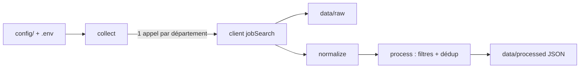

# Bot Veille Alternance — Étude API LBA & architecture V0

> Étude du 2026-09-25. **Ce fichier est la version de référence.**

L'API officielle La Bonne Alternance permet de construire la V0 : recherche par codes ROME et par départements, réponse JSON riche, gratuite pour un usage non lucratif. La contrainte principale : 150 résultats maximum par source et par requête, sans pagination.

## Contexte et méthode

- Projet : outil Python personnel de veille d'alternance orienté systèmes, réseaux, infrastructure — Île-de-France et Loiret.
- Phase 0 : étude seule, aucun code écrit.
- Source principale : la spec OpenAPI officielle (OpenAPI 3.1, version `256bb22`), téléchargée le 2026-09-25, complétée par la page Explorer et data.gouv.
- **Documenté** = écrit dans une source officielle. **Déduction** = interprétation, à confirmer par un appel réel.
- Aucun appel authentifié n'a été fait (pas de clé) ; seul le refus sans clé (401) a été vérifié.

## API identifiée et authentification

L'API à cibler est l'« API Apprentissage » (beta.gouv), qui expose La Bonne Alternance sous `/job/v1/*`. Base URL : `https://api.apprentissage.beta.gouv.fr/api`.

- L'ancienne route `labonnealternance.apprentissage.beta.gouv.fr/api/v1/jobs` répond 404 : à ne pas utiliser (vérifié).
- **Clé obligatoire** (documenté + vérifié) : sans clé, `401 "Vous devez fournir une clé d'API valide"`.
- **Format** : en-tête `Authorization: Bearer <clé>`.
- **Obtention** : compte sur api.apprentissage.beta.gouv.fr, puis jeton depuis `/fr/compte/profil`.
- **Deux types de clé** (documenté), même URL pour les deux :
    - Sandbox : accordée automatiquement ; la recherche d'offres passe par l'environnement de recette LBA, donc les offres ne sont pas les vraies.
    - Production : nécessaire pour les vraies offres. La spec est ambiguë sur le processus (« create a production key » vs demande au support pour les habilitations d'écriture).
- **Conditions** (documenté, Explorer) : gratuit, réservé aux usages non lucratifs, revente et usage commercial interdits. Licence Ouverte 2.0 (data.gouv).
- Contact : contact-api@labonnealternance.apprentissage.beta.gouv.fr

## Endpoints utiles

Un seul endpoint suffit à la V0 : `GET /job/v1/search` (`jobSearch`).

| Méthode | URL | Rôle | Rate limit | V0 |
| --- | --- | --- | --- | --- |
| GET | `/job/v1/search` | Recherche temps réel (`jobSearch`) | 60 appels/min | Oui |
| GET | `/job/v1/offer/{id}` | Détail d'une offre | 120 appels/min | Non |
| GET | `/job/v1/export` | Export complet (`jobsExport`) | 2 appels/min | Non |
| GET | `/geographie/v1/commune/search?code=` | Commune par code INSEE/postal | non précisé | Optionnel |
| GET | `/geographie/v1/departement` | Liste des départements | non précisé | Non |

Hors périmètre : `POST /job/v1/offer`, `POST /job/v1/apply`, formations, organismes, certifications. `/offer/{id}` est inutile en V0 car la recherche renvoie déjà l'offre complète (déduction).

## Paramètres de jobSearch

Tous les paramètres sont en query string et optionnels (documenté). Nos deux filtres clés sont `romes` et `departements`.

| Paramètre | Type | Valeurs attendues | Exemple | Utilité pour nous |
| --- | --- | --- | --- | --- |
| `departements` | array de strings, paramètre répété | numéros de département | `departements=75&departements=92` | Clé : IDF (75, 77, 78, 91, 92, 93, 94, 95) + Loiret (45) |
| `romes` | string | codes ROME séparés par des virgules | `M1801,M1810` | Filtre métier principal |
| `target_diploma_level` | string | `3` à `7` | `6` | Niveau visé ; les offres au niveau inconnu sont aussi renvoyées |
| `latitude` | number | -90 à 90 | `48.8566` | Recherche par point |
| `longitude` | number | -180 à 180 | `2.3522` | Avec la latitude ; sans les deux = toute la France |
| `radius` | number | 0 à 200 km, défaut 30 | `30` | Seulement avec lat/lon |
| `rncp` | string | `^RNCP\d{3,5}$`, un seul code | `RNCP34436` | Ciblage d'un diplôme précis, peu utile en veille métier |
| `opco` | string | enum de 11 OPCO | `ATLAS` | Peu utile |
| `partners_to_exclude` | array de strings | libellés de partenaires | `Hellowork` | Exclure une source bruitée |

**Absents de l'API** (documenté par leur absence) : pagination, nombre de résultats, type de contrat, mot-clé libre, télétravail. Ces filtres se feront en Python.

**Anomalies de la doc** : exemples de latitude et longitude inversés ; comportement non documenté pour `departements` + lat/lon, et pour `romes` + `rncp`.

**Codes ROME candidats** (déduction initiale, **invalidée en production** : voir « Résultats des tests production ») :

- M1801 — administration de systèmes d'information
- M1810 — production et exploitation de SI
- M1802 — expertise et support en SI
- M1804 — études et développement de réseaux télécoms
- I1401 — maintenance informatique et bureautique

## Structure des réponses

La réponse est un objet `{ jobs[], recruiters[], warnings[] }` (documenté). Chaque offre de `jobs[]` contient tous les champs dont nous avons besoin.

| Besoin | Champ(s) dans `jobs[]` |
| --- | --- |
| Identifiant | `identifier.id` (null pour France Travail), `identifier.partner_job_id`, `identifier.partner_label` |
| Titre | `offer.title` |
| Description | `offer.description` |
| Entreprise | `workplace.name`, `brand`, `legal_name`, `siret`, `size`, `website`, `domain.naf` |
| Localisation | `workplace.location.address`, `workplace.location.geopoint.coordinates` (GeoJSON, a priori [lon, lat]) |
| Contrat | `contract.type[]` (`Apprentissage` / `Professionnalisation`), `contract.start`, `contract.duration` (mois) |
| Télétravail | `contract.remote` : `onsite` / `remote` / `hybrid` / null |
| Compétences | `offer.desired_skills[]`, `offer.to_be_acquired_skills[]`, `offer.access_conditions[]` |
| Diplôme | `offer.target_diploma.european` + `.label` (peut être null) |
| ROME | `offer.rome_codes[]` |
| Candidature | `apply.url`, `apply.phone`, `apply.recipient_id` |
| Dates et statut | `offer.publication.creation` / `.expiration`, `offer.status` (seules les offres `Active` sont renvoyées) |
| Source | `identifier.partner_label` |

**Différence avec `recruiters[]`** : un recruteur ne contient que `identifier.id`, `workplace` et `apply` — ni `offer`, ni `contract`, ni ROME.

**`warnings[]`** : liste de `{ code, message }`, contenu réel non documenté.

## Sources des offres

Les deux catégories d'offres nous intéressent ; les recruteurs sont hors V0.

| Catégorie | Ce que c'est | Volume 2025 (Explorer) | Intérêt pour nous |
| --- | --- | --- | --- |
| `offres_emploi_lba` | Offres déposées directement sur La Bonne Alternance | ~25 000 | Source la plus fiable et la plus complète |
| `offres_emploi_partenaires` | Offres des partenaires : France Travail, Météojobs, flux directs (Enedis, Engie), multidiffuseurs (Talentplug, Veritone) | ~325 000 | L'essentiel du volume |
| `recruteurs_lba` | Entreprises à fort potentiel d'embauche, sans offre publiée (marché caché) | ~400 000 | Candidatures spontanées, V1 |

**Déduction** : `offres_emploi_partenaires` est une catégorie, pas une valeur de `partner_label`. Chaque partenaire y a son propre libellé (ex. `Hellowork`) ; la spec ne cite que `offres_emploi_lba` et `recruteurs_lba` comme valeurs.

## Limites et jobsExport

La limite qui structure tout : 150 offres par source et par requête, soit 450 au maximum, sans pagination. La doc précise qu'il est impossible de récupérer toutes les offres d'une recherche.

- **Plafond** (documenté) : 150 offres par source (LBA, France Travail, autres partenaires) + 150 recruteurs.
- **Tri** (documenté) : source, puis distance croissante (recherche géolocalisée), puis date de création décroissante. Une requête saturée perd donc les offres anciennes ou lointaines (déduction). Remède : découper par département × ROME.
- **Pagination** : aucune pour les offres. Le schéma `Pagination` n'existe que pour formations et organismes.
- **Rate limit** (documenté) : 60 appels/min sur la recherche. En-têtes `x-ratelimit-limit`, `x-ratelimit-remaining`, `x-ratelimit-reset`, `retry-after`.
    - Incohérence : le texte annonce HTTP 429, le schéma d'erreur dit `419`.
    - data.gouv annonce « 5 à 20 appels/s » ; on retient la spec, plus précise.
- **Géographie** : France entière par défaut, rayon maximal 200 km.
- **Sources** : les offres France Travail sont lues à la volée (pas d'`id` LBA) ; la liste des partenaires change régulièrement.
- **Usage** : non lucratif uniquement.

### jobsExport

`GET /job/v1/export` renvoie une URL S3 valable 2 minutes vers un JSON de toutes les opportunités (offres + recruteurs), même structure que la recherche. Mise à jour quotidienne à 3 h, 2 appels/min, taille non documentée.

**Verdict** (déduction) : inutile en V0. Neuf départements × une requête ROME = une dizaine d'appels, loin du quota. L'export devient utile si les requêtes saturent le plafond de 150, ou pour un historique exhaustif.

## Adéquation V0, report V1, points à vérifier

L'API couvre la V0, à condition d'obtenir une clé de production et de faire en Python les filtres que l'API n'offre pas.

### Ce que l'API permet pour la V0

- Filtre métier par `romes` (systèmes, réseaux, infrastructure).
- Zones par `departements` : 75, 77, 78, 91, 92, 93, 94, 95, 45.
- Réponse JSON riche et stable, directement exploitable en Python.
- Gratuit, quota largement suffisant.

### À faire côté Python

- Filtrer le type de contrat.
- Filtrer par mots-clés dans le titre et la description.
- Dédupliquer (même offre renvoyée par plusieurs requêtes).

### Reporté en V1

- Récupération exhaustive via `jobsExport`.
- Exploitation complète des `recruiters` : collecte exhaustive (découpage ROME × département pour dépasser 150), filtre par secteur NAF et taille, détection des nouvelles entreprises. La V0 n'en fait qu'une collecte simple (décision du 2026-09-26).
- Candidature via l'API.
- France Travail en direct.
- Historique et détection des nouvelles offres.

### Points à vérifier avec une clé

Tests sandbox du 2026-09-25 : voir la section « Résultats des tests sandbox » plus bas.

- [x] Sandbox représentative ? **Non pour les offres** (10 offres pour toute la France sur M1810 + M1801). Clé de production nécessaire avant d'évaluer la pertinence.
- [x] Format de `departements` : paramètre **répété** (`departements=75&departements=92`). Le format virgule (`75,92`) renvoie 0 résultat **sans erreur**. Avec lat/lon : les deux filtres se cumulent (ET).
- [x] Codes ROME : format `D1234` validé (400 sinon). M1801, M1810, M1802, M1804, I1401 acceptés. Pertinence à réévaluer en production.
- [x] `warnings` : toujours vide dans nos tests, y compris quand `recruiters` est saturé à 150.
- [ ] Code HTTP en cas de dépassement de quota : **non testé** (volontairement, pour ne pas saturer l'API). Gérer 419 et 429.
- [x] Dates : ISO 8601 UTC (`2026-08-26T03:27:28.026Z`). `description` : texte brut avec `\n` en sandbox, mais **HTML présent en production** (7 sur 48) et entités `&amp;` dans les titres.
- [x] `partner_label` réels : `France Travail`, `RH Alternance`, `Meteojob`, `Nos Talents Nos Emplois`, `PASS`, `Le bon coin emploi`.

## Résultats des tests sandbox (2026-09-25)

Clé sandbox, appels curl manuels sur `GET /job/v1/search`. Deux réponses réelles sont sauvegardées dans `tests/fixtures/`.

| Requête | HTTP | jobs | recruiters | Constat |
| --- | --- | --- | --- | --- |
| `departements=75&romes=M1801,M1810` | 200 | 2 | 150 | Offres toutes en 75 |
| `departements=75&departements=92&romes=M1801,M1810` | 200 | 2 | 150 | Recruteurs 75 + 92 (75/75) : le paramètre répété fonctionne |
| `departements=75,92&romes=M1801,M1810` | 200 | 0 | 0 | Format virgule : échec silencieux |
| `romes=M1801,M1810` (France entière) | 200 | 10 | 150 | Sandbox très pauvre en offres |
| `departements=45&romes=M1801,M1810,M1802,M1804,I1401` | 200 | 0 | 91 | Aucune offre Loiret en sandbox |
| `departements=45&latitude=48.8566&longitude=2.3522&radius=10&…` | 200 | 0 | 0 | Département ET rayon cumulés |
| `romes=M1801` / `M1810` / `M1802` / `M1804` / `I1401` | 200 | 0 / 10 / 7 / 2 / 3 | 150 | Codes acceptés |
| `romes=XYZ` | 400 | — | — | Message clair : format attendu `D1234` |
| `target_diploma_level=9` | 400 | — | — | Valeurs 3 à 7 uniquement |
| `departements=45` sans `romes` | **504** | — | — | Timeout : toujours filtrer par ROME |
| `rncp=RNCP34436` avec ou sans `romes=M1801` | 200 | 39 | 150 | `rncp` **remplace** `romes` (résultats identiques) |

**Constats utiles pour l'implémentation :**

- En-têtes reçus : `x-ratelimit-limit: 60`, `x-ratelimit-remaining`, `x-ratelimit-reset: 60`. Conforme à la spec.
- Les offres France Travail **ont** un `identifier.id` en sandbox, contrairement à ce que dit la doc. Garder quand même `partner_label` + `partner_job_id` comme clé.
- Offres partenaires très pauvres : sur 14 offres observées, `workplace.name` est null pour 10, `target_diploma` et `contract.start` null pour 14, `contract.remote` null pour 14. La normalisation doit tolérer ces null.
- `recruiters` sature à 150 dès qu'on n'est pas sur un petit département. Hors V0, mais à savoir.
- `apply.url` pointe vers le site du partenaire (ex. meteojob.com) ; pour les recruteurs, vers le site de recette LBA.

## Résultats des tests production (2026-09-25)

Clé de production (vérifié : les URLs renvoyées pointent vers le domaine de production, pas la recette). Une réponse réelle est sauvegardée : `tests/fixtures/jobsearch_prod_75_rome_M18xx_I14xx.json`.

**Constat majeur : les offres sont indexées en codes ROME 4.0.** Les 5 codes candidats de l'étude ne renvoient que 4 offres en IDF + Loiret. Les offres informatiques portent d'autres codes (M1855, M1858, M1889, I1404, M1811, M1812…).

**Balayage** de tous les codes M1801–M1899 et I1401–I1415 sur les 9 départements (114 appels) : 33 codes portent au moins une offre.

| Code | Offres (IDF + 45) | Exemples de titres observés |
| --- | --- | --- |
| M1828 | 17 | Chargé de projet IT, chef de projet marketing |
| M1805 | 16 | Sujets de stage/alternance variés |
| I1404 | 13 | Apprenti informatique, technicien support helpdesk |
| M1858 | 12 | Service Delivery Manager IT, maintenance bâtiment |
| M1811 | 10 | BI, data, gouvernance des données |
| M1806 | 9 | Assistant chef de projet IT, graphiste |
| M1855 | 6 | Développeur web, développement logiciel |
| M1889 | 6 | Software engineer IA / backend |
| M1812 | 4 | Responsable opération réseaux, cybersécurité OT |
| M1861 | 4 | RUN applicatif, tech lead |
| M1802 | 3 | Ingénieur système Linux, administrateur système |
| M1810 | 2 | Ingénieur exploitation |
| M1822, M1817, M1863, M1830 | 1–2 chacun | Administrateur SI, SSI, homologation SSI |

Les 20 autres codes ont 1 à 6 offres chacun, souvent hors sujet (électroménager, marketing, géomatique).

**Volume réel** : 92 offres uniques pour toute la famille M18xx + I14xx en IDF + Loiret (fin septembre, en fin de saison de recrutement). Aucune source ne sature le plafond de 150. Aucune offre `offres_emploi_lba` sur ces codes à Paris : l'essentiel vient de France Travail, PASS (fonction publique), RH Alternance, Veritone.

**Autres constats production :**

- **114 codes ROME dans un seul appel** fonctionnent (HTTP 200, 0,5 s).
- Le code ROME n'est **pas un filtre fiable** : un même code mélange des offres pertinentes et hors sujet. Le filtrage par mots-clés en Python devient le filtre principal.
- **Entités HTML** dans les titres (`&amp;`) et **balises HTML** dans 7 descriptions sur 48 : il faudra les nettoyer à la normalisation.
- `contract.remote` : null sur 100 % des offres observées. Le télétravail est inexploitable via ce champ.
- `workplace.name` null sur 16 offres sur 48.

**Stratégie recommandée pour la V0** (déduction) :

1. Une requête par département avec **toute la famille M18xx + I14xx** (codes renvoyant des offres) : large filet, pas de saturation.
2. Filtrage par **mots-clés** sur titre + description (système, réseau, infrastructure, admin, support, exploitation, cybersécurité, Linux, Windows…) et **exclusions** (marketing, commercial, graphiste…).
3. Réévaluer la liste des codes périodiquement : le référentiel et les volumes évoluent.

**Comparaison avec le site (vérifié le 2026-09-25)** : le site affiche 1 409 résultats pour « informatique », département Paris, filtre Apprentissage. Ce chiffre **n'est pas un nombre d'offres**. Reproduit exactement via l'API interne du site (`q=informatique&admin_area=departement:75&contract_type=Apprentissage`) :

| Type (facette du site) | Résultats |
| --- | --- |
| Candidatures spontanées (`recruteurs_lba`) | 1 388 |
| Offres d'emploi partenaires | 21 |
| **Total affiché** | **1 409** |

Les 21 offres (recherche texte « informatique ») sont cohérentes avec l'API publique : 48 offres à Paris sur la famille M18xx + I14xx, plus large que le mot « informatique ». Le volume de ~92 offres IT en IDF + 45 est donc **le volume réel**, pas une limite de l'API.

Le site utilise une API interne non documentée (`/api/v1/search` sur le domaine du site : texte libre, pagination). Elle ne fait pas partie de l'API publique ni de ses conditions d'usage : **ne pas l'utiliser** dans le projet.

## Architecture du projet V0

La V0 est un script en ligne de commande : il interroge `jobSearch` pour chaque département, normalise, filtre, déduplique et écrit un fichier JSON. Pas de base de données, pas d'IA, pas d'interface. Rien n'est implémenté à ce stade.

### Arborescence

Voir aussi `docs/architecture.md`.

```
Bot_Veille_Alternance/
├── .gitignore
├── .env.example              LBA_API_KEY=  (le vrai .env n'est jamais versionné)
├── src/
│   └── veille_alternance/    code exécutable : config.py, client.py, collect.py,
│                             normalize.py, process.py, output.py, __main__.py
├── config/                   paramétrage sans logique : ROME, départements, mots-clés
├── data/                     non versionné
│   ├── raw/                  réponses API brutes, une par requête
│   └── processed/            offres_AAAA-MM-JJ.json
├── docs/                     étude API, architecture, décisions
├── tests/
│   └── fixtures/             vraies réponses API sauvegardées
└── scripts/                  utilitaires ponctuels (appel manuel de test)
```

### Flux de données



### Rôle de chaque module

| Module | Entrée | Sortie | Ne fait pas |
| --- | --- | --- | --- |
| `config.py` | `config.toml`, variable `LBA_API_KEY` | objet de configuration | aucun appel réseau |
| `client.py` | paramètres de recherche | JSON brut de l'API | aucune transformation |
| `collect.py` | configuration | liste de réponses brutes + fichiers `data/raw/` | aucun filtrage |
| `normalize.py` | une réponse brute | liste d'`Offre` | aucun filtrage |
| `process.py` | liste d'`Offre` | liste filtrée et dédupliquée | aucun accès disque ni réseau |
| `output.py` | liste d'`Offre` | `data/processed/offres_AAAA-MM-JJ.json` | aucune logique métier |

### Offre normalisée (champs retenus)

| Champ | Source API |
| --- | --- |
| `cle` | `partner_label` + `partner_job_id` |
| `source` | `identifier.partner_label` |
| `titre` | `offer.title` |
| `entreprise` | `workplace.name` |
| `adresse` | `workplace.location.address` |
| `departement` | département de la requête |
| `contrat` | `contract.type[]` |
| `teletravail` | `contract.remote` |
| `debut` | `contract.start` |
| `niveau` | `offer.target_diploma.european` |
| `romes` | `offer.rome_codes[]` |
| `description` | `offer.description` |
| `url` | `apply.url` |
| `publiee_le` | `offer.publication.creation` |

### Recruteur normalisé (collecte simple, décision du 2026-09-26)

Les recruteurs (`recruiters[]`, candidatures spontanées) arrivent dans les mêmes réponses que les offres : aucun appel supplémentaire. La V0 les enregistre dans un second fichier, `data/processed/recruteurs_AAAA-MM-JJ.json`, dédupliqués par SIRET, **sans filtrage**. La couverture est partielle (150 par requête), c'est assumé.

| Champ | Source API |
| --- | --- |
| `siret` | `workplace.siret` (clé de déduplication, repli sur `identifier.id` si null) |
| `nom` | `workplace.name` |
| `adresse` | `workplace.location.address` |
| `departement` | département de la requête |
| `taille` | `workplace.size` |
| `secteur` | `workplace.domain.naf.label` |
| `naf` | `workplace.domain.naf.code` |
| `site_web` | `workplace.website` |
| `telephone` | `apply.phone` |
| `url` | `apply.url` (page LBA de l'entreprise) |

### Décisions d'architecture

- **Un appel par département**, avec tous les ROME dans `romes` : 9 appels par exécution, loin des 60/min. On découpe par ROME seulement si une source atteint 150 résultats.
- **Détection de saturation** : si une source renvoie exactement 150 offres, on l'écrit dans le journal. Pas de découpage automatique en V0.
- **Réponses brutes conservées** dans `data/raw/` : on peut rejouer la normalisation sans rappeler l'API, et déboguer.
- **Clé d'API** uniquement dans `.env` / variable d'environnement, jamais dans le code ni dans git.
- **Bibliothèques** : `requests` + `python-dotenv` ; `tomllib` (standard depuis Python 3.11) pour la configuration.
- **Modules purs** : `normalize` et `process` sont testables sans réseau, grâce à une réponse sauvegardée dans `tests/fixtures/`.

### Ordre de mise en œuvre suggéré

1. Créer une clé sandbox et faire un appel manuel (curl) pour lever les points à vérifier.
2. `client.py` : un appel qui sauvegarde une réponse brute.
3. `normalize.py` + premier test sur cette réponse.
4. `collect.py` : boucle sur les 9 départements.
5. `process.py` : filtres et déduplication, avec tests.
6. `output.py` + `__main__.py` : exécution complète.

## Sources

- [Spec OpenAPI officielle — API Apprentissage](https://api.apprentissage.beta.gouv.fr/api/documentation/json) (version 256bb22)
- [Explorer — recherche d'offres](https://api.apprentissage.beta.gouv.fr/fr/explorer/recherche-offre)
- [data.gouv — API La bonne alternance](https://www.data.gouv.fr/dataservices/api-la-bonne-alternance)
